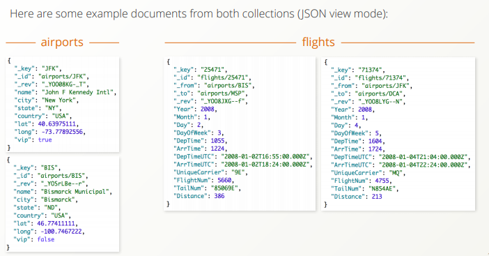

# Graph Course
## 本课程学习目标
* 关于图的基础知识
* ArangoDB的架构以及多模型是什么
* 怎么导入图数据
* 用ArangoDB的查询语言 AQL 进行查询
    * 通过过滤，排序等进行数据检索
    * 简单的图查询
    * 遍历具有不同选项的图形
    * 最短路径查询

## Introduction(简介)
### Graph Basics(图的基本知识)
在离散数学中，图形被定义为顶点和边的集合。在计算机中，它被认为是一种抽象的数据类型，它非常适合表示连接或关系 ,与关系数据库系统的表格数据结构不同。


对图的一个好的比喻是将节点视为圆点、边视为线或弧。 术语节点和顶点在这里可互换使用。通常顶点通过边连接，构成图形。 顶点不必连接，但它们也可以通过多个边连接多个其他顶点。 您还可以找到与自身连接的顶点。

**重要的图类型**
* 无向图  

* 有向图  

* 有向无环图(DAG)  


在ArangoDB中，每个边都有一个方向，它不能同时指向两个方向。 该模型也称为定向图(oriented graph)。    


边始终是有向的，但是当您遍历图时，可以忽略方向（沿任意方向），或者沿反方向（INBOUND）而不是沿着它们实际指向的方向（OUTBOUND）。  


ArangoDB允许您存储不同形状和大小的各种图形，包括循环和不循环。 您可以在两个顶点之间或甚至相同的顶点之间保存一个或多个边。另请注意，边是完整的JSON文档，这意味着您可以根据需要在边存储尽可能多的信息！  


### The Example Dataset(数据集示例)
我们采用了美国机场和航班的数据集，对其进行了扩充和简化。 包括2008年1月1日至15日的3,000多个机场和大约300,000个航班。  


  
  

## Concepts of ArangoDB(ArangoDB概念)
### What is Multi-Model(多模型是什么)
* ArangoDB是一个原生多模型数据库
    * 多模型: ArangoDB支持三种主要的NoSQL数据模型
    * 原生:支持所有数据模型具有一个数据库内核和一种查询语言（AQL）
* AQL的独特功能：
    * 可以在单个查询中组合所有3个数据模型。
    * 在查询中组合联接，遍历，过滤器，地理空间操作和聚合  


**How is multi-model possible at all?**
* 如果您存储JSON文档并将其视为主键下的不透明值，则您具有键/值存储。
* ArangoDB是一个使用主键的面向文档的数据存储
* 边缘文档中指向其他文档的_from和_to属性组成了ArangoDB中的图形  


### ArangoDB Architecture(ArangoDB架构)
**ArangoDB具有与其他数据库一样的存储层次结构：**
* 您可以创建可以容纳任意数量**Collections**的不同**Databases**。_system是默认数据库
* **Collections**可以容纳任意数量的**Documents**。 这有两种collection类型：文档和边collections
* **Documents**以**JSON**格式存储。 文档是top-level的JSON对象，其属性名称是字符串，值可以是null，true，false，数字，字符串，数组和嵌套对象。 还有系统属性（_key，_id，_rev，边缘也_from，_to）  


**How do airports & flights form a graph? **
机场是顶点，飞行是边缘。 机场文档的_id属性用于边文档中的_from和_to属性，以通过航班将机场链接在一起。  


**Edge collections in summary:**
* Place to hold relations(用于保存图的关系)
* Contain documents, but with special attributes 
    *  _from: _id value of the source vertex
    * _to: _id value of the target vertex
* Built-in edge index for every edge collection(对于每个边集合都内置边索引)
* Building block of graphs(构建图块)

## Preparations for this Course（课程前期准备）
### Download and install ArangoDB（下载并安装ArangoDB）
* 去官网[https://www.arangodb.com/download/](https://www.arangodb.com/download/)根据自己的系统信息下载并安装arangodb，更详细的入门知识可以查看h[https://www.docs.arangodb.com/latest/Manual/Installation](ttps://www.docs.arangodb.com/latest/Manual/Installation)
* 启动服务器后，在浏览器中打开**http：// localhost：8529**以访问Aardvark，ArangoDB WebUI
* 使用您的凭据登录，如 root，如果您没有设置密码，请保留密码场空。
* 选择一个数据库，例如 默认的_system数据库。

### Import the Dataset - Airport（导入机场数据）
* 去[https://www.arangodb.com/arangodb_graphcourse_demodata/](https://www.arangodb.com/arangodb_graphcourse_demodata/)下载样例数据集
* 解压数据集里面有 airports.csv 和 flights.csv两个数据集文件
* 使用ArangoDB的导入工具 arangoimport 导入airports。
   在命令行上运行以下命令（单行）：
```
arangoimport --file path to airports.csv on your machine --collection airports --create-collection true --type csv
例如:arangoimport --file /home/intellif/GraphCourse/airports.csv --collection airports --create-collection true --type csv
```
你可以用 **--server.username name**指定出root以外的用户，如果您未设置密码或服务器已禁用身份验证，则只需在要求输入密码时按回车键。
在输入import命令后，您应该在控制台中看到类似的内容：  


**arangoimport做了什么？**
* 创建一个主索引为_key的新文档集合(airports)
* 为CSV文件的每一行创建了一个文档（第一行、最后一行以及空行除外）
* 第一行是定义属性名称的标题

**Note:**
* 机场编码在CSV文件中以_key属性提供
* _key属性是唯一标识集合中文档的主键。 因此，我们将能够利用主索引通过机场编码检索机场

### Import the Dataset - Flights（导入飞行数据）
导入的airports是我们图的顶点。 要完成我们的图数据集，我们还需要连接顶点的边。 在我们的例子中，边是flight。

* 使用arangoimport将航班导入边集合。在命令行中运行以下命令（单行）：
```
arangoimport --file path to flights.csv on your machine
             --collection flights --create-collection true --type csv
             --create-collection-type edge
如:arangoimport --file /home/intellif/GraphCourse/flights.csv --collection flights --create-collection true --type csv --create-collection-type edge
```


**arangoimport做了什么？**
* 创建了一个新的边集合（**flight**）,该集合包含属性_key的主索引和_from和_to的边索引
* 为CSV文件的每一行创建了一个边文档（第一行、最后一行以及空行除外）

**Note:**
* _from和_to属性通过引用出发和到达机场的文档_ids来形成图形
* 没有提供_key，因此它会自动生成

## Starting with the dataset
### ArangoDB Qurey Editor
### First AQL Queries-Hands on


## Graph Traversals
### Traversals explained
### Graph Traversal Syntax


## Traversal Options
### Depth vs. Breadth First Search
### Uniqueness Options
### Traversal Options-hands on


## Adavanced Graph Queries
### Shortest Path
### Pattern Matching


## Landing
### Survey and Support
### Exercise Solutions