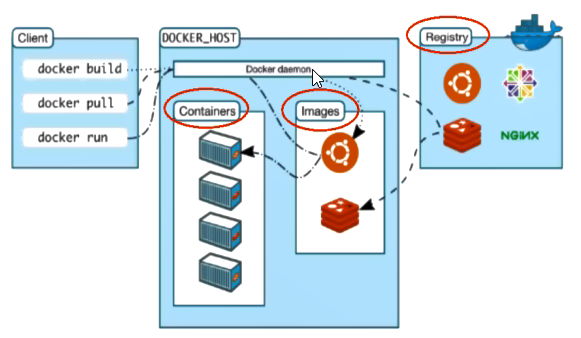

# Docker笔记
## 1.Docker安装
**前提说明**  
**CentOS Docker安装**
```
Docker支持一下的CentOS版本：
CentOS 7(64-bit)
CentOS 6.5(64-bit)或更高的版本
```

**前提条件**    
```
目前，CentOS仅发行版本中内核支持的Docker。  
Docker运行在CentOS 7上，要求系统为64位、系统内核版本为3.10以上  
Docker运行在CentOS-6.5或更高版本的CentOS上，要求系统为64位、系统内核版本为2.6.32-431或更高版本。
```

**查看自己的内核**  
```
uname命令用于打印当前系统相关信息（内核版本号、硬件架构、主机名称和操作系统类型等）：**uname -r**
```

### Docker的基本组成
**Docker架构图**  

**镜像（Image）**

**容器（Container）**
```
Docker利用容器（Container）独立运行的一个或一组应用。**容器是用镜像创建的运行实例**。
它可以被启动、开始、停止、删除。每个容器都是相互隔离的、保证安全的平台。
**可以把容器看做是一个简易版的Linux环境**（包括root用户权限、进程空间、用户空就按和网络空间等）和运行在其中的应用程序。
容器的定义和镜像几乎一模一样，也是一堆层的统一视角，唯一区别在于容器的最上面那一层是可读可写的。
```
**仓库(Repository)**
```
仓库是**集中存放镜像**文件的场所。
仓库和仓库注册服务器（Registry）是有区别的。仓库注册服务器上往往存放着多个仓库，每个仓库中有包含了多个镜像，每个镜像有不同的标签（tag）。
仓库分为公开（Public）和私有仓库（Private）两种形式。
**最大的公开仓库是Docker Hub（https://hub.docker.com/）**，存放了数量庞大的镜像供用户下载。国内的公开仓库包括阿里云、网易云 等。
```
**小总结**
```
需要正确的理解仓储/镜像/容器这几个概念：

Docker本身是一个容器运行载体或称之为管理引擎。我们把应用程序和配置依赖打包好形成一个可交付的运行环境，这个打包好的的运行环境就是Image镜像文件。只有通过这个镜像文件才能生成Docker容器。Image文件可以看做是容器的模板。Docker根据Image文件生成容器的实例。同一个Image文件，可以生成多个同时运行的容器实例。

* image文件生成的容器实例，本身也是一个文件，称为镜像文件。

* 一个容器运行一种服务，当我们需要的时候，就可以通过docker客户端创建一个对应的运行实例，也就是我们的容器

* 至于仓储，就是放了一堆镜像的地方，我们可以把镜像发布到仓储中，需要的时候从仓储中拉下来就可以了。
```

### 安装步骤
** 1. CentOS6.8安装Docker**
```
* 1. yum install -y epel-release
Docker使用EPEL发布，RHEL系的OS首先要确保已经持有EPEL仓库，否则先检查OS的版本，然后安装相应的EPEL包。
* 2. yum install -y docker -io
* 3. 安装后的配置文件：/etc/sysconfig/docker
* 4. 启动Docker后台服务：service docker start
* 5. docker version验证
```

**阿里云镜像加速**
```
* 网址： https://dev.aliyun.com/search.html
```

**2.CnetOS安装Docker**

### HelloWorld
```
docker rum helloworld  //如果本地没有这个镜像，则会去远程镜像仓库拉取，并在容器内运行
```


### 底层原理
**Docker是怎么工作的**
```
Docker是一个Client-Server结构的系统，Docker守护进程运行在主机上，然后通过Socket连接从客户端访问，收进程从客户端接受命令并管理运行在主机上的容器**。容器，是一个运行时环境，就是我们前面说的集装箱**  
```


**为什么Docker比VM快**
```
1. Docker有着比虚拟机更少的抽象层。由于Docker不需要Hypervisor实现硬件资源的虚拟化，运行在Docker容器上的程序直接使用的都是实际物理机的硬件资源。因此在CPU、内存利用率上docker将会在效率上有明显优势。
2. Docker利用的是宿主机的内核，而不需要GuestOS。因此，当新建一个容器时，docker不需要和虚拟机一样重新加载一个操作系统内核。从而避免寻址、加载操作系统内核这个比较费时费资源的过程，当新建一个虚拟机时，虚拟机软件需要加载GuestOS，这个新建过程是分钟级别的。而Docker由于直接利用宿主机的操作系统，则省略了这个过程，因此新建一个docker容器只需要几秒钟。  
```


## 2.Docker常用命令
### 帮组命令

* docker version
* docker info
* docker --help

### 镜像命令
* docker images（列出本地主机上的镜像）  


```
同一仓库源可以有多个**TAG**，代表这个仓库源的不同版本，我们使用**REPOSITORY:TAG**来定义不同的镜像。  
如果你不指定一个镜像的版本标签，例如你只是用Ubuntu，docker将默认使用ubuntu:latest镜像
OPTIONS：
-a：列出本地所有的镜像（喊中间映像层）
-q：只显示镜像ID
--digests：显示镜像的摘要信息
--no-trunc：显示完整的镜像信息
```


* docker search xxx(某个镜像名字)
镜像库网站：https://hub.docker.com
```
docker search [OPTIONS] name
OPTIONS：
--no-trunc：显示完整的镜像描述
-s：列出收藏数不小于指定值得镜像
--automated：只列出automated build类型的镜像  
```

* docker pull xxx(某个镜像名字)
```
    docker pull name[:TAG]    
```

* docker rmi xxx（某个镜像名字ID）
```
docker rmi -f 镜像ID （删除单个）
docker rmi -f 镜像名1：TAG   镜像名2：TAG 
docker rmi -f $(docker images -qa)
```

* docker commit(提交容器副本使之成为一个新的镜像)
```
docker commit -m="提交的描述信息" -a="作者" 容器ID 目标镜像名：[标签名]
例如： docker commit -m="tomcat xxx" -a="dsw" 98s6he8123a atguigu/mytomcat:1.2
```

### 容器命令*
* 有镜像才能创建容器，这是根本前提  
```
docker pull centos
```

* 新建并启动容器  
```
docker run [OPTIONS] IMAGE [COMMAND][ARG...]
OPTIONS说明（常用）：有些是一个减号-，有些是两个减号--    
--name="容器新名字"：为容器指定一个名称  
-d：后台运行容器，并返回容器ID，也即启动弄个守护式容器  
*-i：以交互模式运行容器，通常与-t同时使用  
*-t：为容器重新分配一个伪输入终端，通常与-i同时使用   
    -P：随机端口映射  
    -p：指定端口映射，有以下四种格式  
        ip:hostPort:containerPort  
        ip::containerPort  
        hostPort:containerPort  
        containerPort
例如：docker run -it --name mycentos centos /bin/bash
```


* 列出当前所有正在运行的容器
```
docker ps [OPTIONS]
-a：列出当前所有正在运行的容器+历史上运行过的  
-l：显示最近创建的容器  
-n：显示最近n个创建的容器
-q：静默模式，只显示容器编号
--no-trunc：不截断输出  
例如：docker ps -lq
```

* 退出容器
```
exit   
ctrl+P+Q
```

* 启动容器
```
docker start 容器ID or 容器名  
```
* 停止容器  
```
docker stop 容器ID or 容器名  
```

* 强制停止容器
```
docker kill 容器ID or 容器名  
```

* 删除已停止的容器  
```
docker rm 容器ID  
一次性删除多个容器  
docker rm -f $(docker ps -a -q)
docker ps -a -q | xargs docker rm
```

* 重要

```
    * 启动守护式容器
    docker run -d 容器名  
    例如：docker run -d centos  
    说明：Docker容器后台运行，就必须有一个前台进程，容器运行的命令如果不是那些一直挂起的命令（比如运行top,tail）,就会自动退出
```

* 查看容器日志    

    
```
    docker logs -f -t --tail 容器ID  
    -t：加入时间戳  
    -f：跟随最新的日志打印  
    --tail 数字：显示最后多少条
```

* 查看容器内运行的进程  
    
```
    docker top 容器ID
```

* 查看容器内部细节    

```
    docker inspect 容器ID
```

* 进入正在运行的容器并以命令行交互  
    
``` 
    docker exec -it 容器ID bashShell  （exec是在容器中打开新的终端，兵器可以启动新的进程）
    例如：docker exec -it 12344s4d ls -l /tmp 隔山打牛  or  docker exec -it 12344s4d bin/bash 直接进入容器内部
    docker attach 容器ID  （重新进入，attach 直接进入容器启动命令的终端，不会启动新的进程  ）  
```


* 从容器内拷贝文件到主机上  
```
    docker cp 容器ID：容器内部路径 目的主机路径
```

## 3.Docker镜像
### 是什么
* UnionFS（联合文件系统）
```
UnionFS是一种分层、轻量级并且高性能的文件系统，它支持**对文件系统的修改作为一次提交来层层的叠加**，同时可以将不同目录挂载到同一个虚拟文件系统下。UnionFS是Docker镜像的基础。镜像可以通过分层来进行继承，基于基础镜像（没有父镜像），可以制作各种具体的应用镜像。
**特性：**一次同时加载多个文件系统，但从外面看起来，只能看到一个文件系统，联合加载会把各层文件系统叠加起来，这样最终的文件系统会包含所有底层的文件和目录。
```

* Docker镜像加载原理  
```
docker的镜像实际上有一层一层的文件系统组成，这种层级的文件系统UnionFS。  
bootfs（boot file system）主要包含bootloader和kernel,bootloader主要是引导加载kernel，Linux刚启动时会加载bootfs文件系统，在**Docker镜像的最底层是bootfs**。这一层与我们典型的Linux/Unix系统是一样的，包含boot加载器和内核。当boot加载完成之后整个内核就都在内存中了，此时内存的使用权已由bootfs转交给内核，此时系统也会卸载bootfs。  
rootfs（root file system），在bootfs之上。包含的就是典型Linux系统中的/dev、/proc 、/bin、/etc等标准目录和文件。rootfs就是各种不同的操作系统发行版  
```


**平时我们安装虚拟机的CentOS都是好几个G，为什么dockder这里才200M？？**
```
  对于一个精简的OS，rootfs可以很小，只需要包括最基本的命令、工具和程序库就可以了，因为底层直接用Host的kernel，自己只需要提供rootfs就行了。由此可见对于不同的linux发行版，bootfs基本是一致的，rootfs会有差别，因此不同的发行版可以共用bootfs。  
```

* 分层镜像

* 为什么Docker镜像要采用这种分层结构呢
**最大的 一个好处是 - 共享资源**
比如：有多个镜像都从相同的base镜像构建而来，那么宿主机只需在磁盘上保存一份base镜像，同时内存中也只需加载一份base镜像，就可以问所有容器服务了。而且镜像的每一层都可以被共享。

## 4.Docker容器数据卷
### 是什么
```
**Docker理念**  

* 将运行与运行的环境打包形成容器运行，运行可以伴随着容器，但是我们对数据的要求希望是持久化的
* 容器之间希望有可能共享数据

Docker容器产生的数据，如果不通过docker commit生成新的镜像，使得数据作为镜像的一部分保存下来，那么当容器删除后，数据自然也就没有了。
```

### 能干嘛（实现容器和主机间的数据共享）
```
卷就是目录或文件，存在于一个或多个容器中，由docker挂载到容器，但不属于联合文件系统，因此能够绕过Union File System提供一些用于持续存储或共享数据的特性。  
卷的设计目的就是数据的持久化，完全独立于容器的生存周期，因此Docker不会在容器删除时删除其挂载的数据卷。

特点：  
1：数据卷可在容器之间共享或重用数据
2：卷中的更改可以直接生效  
3：数据卷中的更改不会包含在镜像的更新中
4：数据卷的生命周期一直持续到没有容器使用它为止
```

### 数据卷（容器内添加）
#### 直接命令添加  
```
docker run -it -v /宿主机绝对路径目录：/容器内目录  镜像名
例如：docker run -it -v /myDataVolume：/dataVolumeContainer centos

查看数据卷是否挂载成功： docker inspect  

容器和宿主机之间数据共享

容器停止退出后，主机修改后数据是同步的

带权限命令：docker run -it -v /宿主机绝对路径目录：/容器内目录：ro  镜像名  
例如：docker run -it -v /myDataVolume：/dataVolumeContainer：ro centos
```


#### DockerFile添加  
* 根目录下新建mydocker文件夹并进入  
```
可在Dockerfile中使用**VOLUME指令**来给镜像添加一个或多个数据卷  
VOLUME ["/dataVolumeContainer","/dataVolumeContainer2","/dataVolumeContainer3"]
说明：
出于可移植和分享的考虑，用-v 主机目录：容器目录 这种方法不能够直接在Dockerfile中实现。  
由于宿主机目录是依赖于特定宿主机的，并不能够保证在所有的宿主机上都存在这样的特定目录。
```
 
* File构建  
**dockerfile**
```
 FROM centos
VOLUME ["/dataVolumeContainer","/dataVolumeContainer2","/dataVolumeContainer3"]
CMD echo "finished, -------success1"
CMD /bin/bash
```
* build后生成镜像——获得一个新镜像zzyy/centos  
```  
docker build -f /mydocker/dockerfile -t zzyy/centos .
```
* run容器  
```
docker images zzyy/centos
```

* 通过上述步骤，容器内的卷目录地址已经知道，对应的主机目录地址在哪?  
```
主机对应默认地址
```

* 备注  
```
Docker挂载主机目录Docker访问出现cannot open directory .: Permision denied  
解决办法：在挂载目录后多加一个--privileged=true参数即可
```
  

### 数据卷容器
* **是什么**
```
命名的容器挂载数据卷，其他容器通过挂载这个（父容器）实现数据共享，挂载数据卷的容器称之为数据卷容器
```
* **总体介绍  **
```
以上一步新建的镜像zzyy/centos为模板并运行容器dc01、dc02、dc03  
他们已经具有容器卷 /dataVolumeContainer1 和 /dataVolumeCOntainer2
```
* **容器间传递共享（-volumes-from）**    
结论：容器之间配置信息的传递，数据卷的生命周期一直持续到没有容器使用它为止

## 5.DockerFile解析
### 是什么
* Dockerfile是用来构建Docker镜像的构建文件，是由一系列命令和参数构成的脚本

* 构建三步骤
```
1.  编写Dockerfile文件  
2.  docker build  
3.  docker run  
```

* 文件什么样
```
FROM scratch
MAINTAINER https://github.com/CentOS/sig-cloud-instance-images
ADD centos-6-docker.tar.xz /

LABEL org.label-schema.schema-version="1.0" \
    org.label-schema.name="CentOS Base Image" \
    org.label-schema.vendor="CentOS" \
    org.label-schema.license="GPLv2" \
    org.label-schema.build-date="20181006"

CMD ["/bin/bash"]
```

### DockerFile构建过程解析  
* **Dockerfile内容基础知识**
```
1. 每条保留字指令都必须为大写字母且后面要跟随至少一个参数  
2. 指令按照从上到下，顺序执行  
3. #表示注释  
4. 每条指令都会创建一个新的镜像层，并对镜像进行提交
```

* **Docker执行Dockerfile的大致流程**
```
1. docker从基础镜像运行一个容器
2. 执行一条指令并对容器做出修改
3. 执行类似docker commit的操作提交一个新的镜像层
4. docker再基于刚提交的镜像运行一个新容器
5. 执行dockerfile中的下一条指令直到所有指令都执行完成
```

### DockerFile体系结构（保留字段指令）
```
FROM         基础镜像  \\当前新镜像是基于那个镜像的
MAINTAINER   镜像维护者的名字和邮箱地址
RUN          容器构建时需要运行的命令
EXPOSE       当前容器对外暴露出的端口
WORKDIR      指定在创建容器后，终端默认登录进来的工作目录
ENV          用来在构建镜像过程中设置环境变量
              例如：ENV     MY_PATH /usr/mytest        WORKDIR $MY_PATH
ADD          将宿主机目录下的文件拷贝进镜像，且ADD命令会自动处理URL和解压tar压缩包
COPY         类似于ADD，拷贝文件和目录到镜像中  1. COPY src dest   2. COPY["src","dest"]    
VOLUME       容器数据卷，用于数据保存和持久化工作
CMD          指定一个容器启动时要运行的命令， Dockerfile中可以有多个CMD指令，但只有最后一个会生效
ENTRYPOINT   指定一个容器启动时要运行的命令, Dockerfile中可以有多个ENTRYPOINT指令时会追加
ONBUILD      当构建一个被继承的Dockerfile时运行命令，父镜像在被子继承后父镜像的onbuild被触发
```


### 案例


### 小总结


