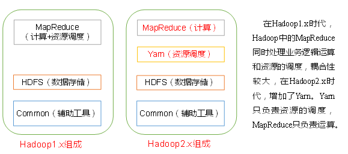
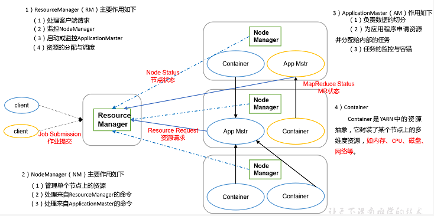
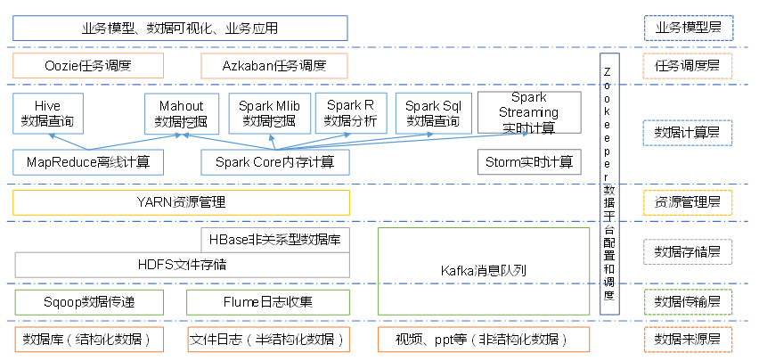
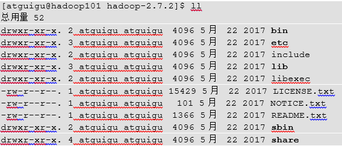

# Hadoop入门
## 第 2 章 从Hadoop框架讨论大数据生态
### 2.1 Hadoop是什么
```
1. Hadoop是一个由Apache基金会开发的分布式系统基础架构
2. 主要解决海量数据的**存储**和海量数据的**分析计算**问题
3. 广义上来说，Hadoop通常是指一个更广泛的概念——Hadoop生态圈
```

### 2.3 Hadoop三大发行版本
```
Hadoop 三大发行版本：Apache、Cloudera、Hortonworks
1. Apache版本最原始（最基础）的版本，对于入门学习最好。
2. Cloudera在大型互联网企业中用的较多。
3. Hortonworks文档较好。
```

### 2.4 Hadoop的优势（4高）
```
1. 高可靠性：Hadoop底层维护多个数据副本，所以即使Hadoop某个计算元素或存储出现故障，也不会导致数据的丢失。
2. 高扩展性：在集群间分配任务数据，可方便扩展数以千计的节点
3. 高效性：在MapReduce的思想下，Hadoop是并行工作的，以加快任务处理速度
4. 高容错性：能够自动将失败的任务重新分配
```

### 2.5 Hadoop组成（面试重点）
**Hadoop1.x与Hadoop2.x的区别**    


### 2.5.1 HDFS架构概述
```
1. NameNode(nn)：存储文件的元数据，如文件名，文件目录结构，文件属性（生成时间，副本数、文件权限），  
以及每个文件的块列表和块所在的DataNode等。
2. DataNode（dn）：在本地文件系统存储文件块（block）数据，以及块数据的校验和。
3. Secondary NameNode（2nn）：用来监控HDFS状态的辅助后天程序，每个一段时间获取HDFS元数据的快照。
```

### 2.5.2 YARN架构概述


### 2.5.3 MapReduce架构概述
```
MapReduce将计算过程氛围两个阶段：Map和Reduce
1. Map阶段并行处理输入数据
2. Reduce阶段对Map结果进行汇总
```

### 2.6 大数据技术生态体系

```
图中涉及的技术名词解释如下：
1. Sqoop：Sqoop是一款开源的工具，主要用于在Hadoop、Hive与传统数据库（MySQL）间进行数据的传递，可以将一个  
关系型数据库中的数据导入到Hadoop的HDFS中，也可以将HDFS的数据导入到关系型数据库中。
2. Flume：Flume是Cloudera提供的一个高可用的，高可靠的分布式海量日志采集、聚合和传输的系统，Flume支持在日志  
系统中定制各类数据发送方，用于手机数据；同时，Flume提供对数据进行简单处理，并写到各种数据接收方的能力。
3. Kafka：kafka是一种高吞吐量的分布式发布订阅消息系统，有如下特性：
    1. 通过O(1)的磁盘数据结构提供消息的持久化，这种结构对于即使数以TB的消息存储也能够保持长时间的稳定性能。  
    2. 高吞吐量：即使是非常普通的硬件Kafka也可以支持每秒数百万的消息。
    3. 支持通过Kafka服务器和消费机集群来分区消息。
    4. 支持Hadoop并行数据加载。
4. Storm：Storm用于“连续计算”，对数据流做连续查询，在计算时就将结果以流的形式输出给用户。
5. Spark：Spark是当前最流行的开源大数据内存计算框架。可以基于Hadoop上存储的大数据进行计算。
6. Oozie：Oozie是一个管理Hdoop作业（job）的工作流程调度管理系统。
7. Hbase：是一个分布式的、面向列的开源数据库。HBase不同于一般的关系数据库，它是一个适合于非结构化数据存储的数据库。
8. Hive：Hive是基于Hadoop的一个数据仓库工具，可以将结构化的数据文件映射为一张数据库表，并提供简单的SQL查询功能，  
可以将SQL语句转换为MapReduce任务进行运行。 其优点是学习成本低，可以通过类SQL语句快速实现简单的MapReduce统计，  
不必开发专门的MapReduce应用，十分适合数据仓库的统计分析。
9. Mahout：Apache Mahout是个可扩展的机器学习和数据挖掘库。
10. ZooKeeper：Zookeeper是Google的Chubby一个开源的实现。它是一个针对大型分布式系统的可靠协调系统，提供的功能包括：  
配置维护、名字服务、 分布式同步、组服务等。ZooKeeper的目标就是封装好复杂易出错的关键服务，将简单易用的接口和性能高效、  
功能稳定的系统提供给用户。
```

## 第 3 章 Hadoop目录结构
### 3.1 Hadoop目录结构

```
1. bin目录：存放对Hadoop相关服务（HDFS、YARN）进行操作的脚本
2. etc目录：Hadoop的配置文件目录，存放Hadoop的配置文件
3. lib目录：存放Hadoop的本地库（对数据进行压缩解压缩功能）
4. sbin目录：存放启动或停止Hadoop相关的脚本
5. share目录：存放Hadoop的依赖jar包、文档、和官方案例
```

## 第4章 Hadoop运行模式
### 4.3 完全分布式运行模式（开发重点）
#### 4.3.2 编写集群分发脚本xsync
* **scp (secure copy) 安全拷贝**
```
1. scp定义：
    scp可以实现服务器与服务器之间的数据拷贝。
2. 基本语法
    scp        -r        $pdir/$fname                $user@hadoop$host:$pdir/$fname
    命令    递归    要拷贝的文件路径/名称    目的用户   @    主机    ：  目的路径/名称
3. 案例实操
    a. 在hadoop101上，将hadoop101中/opt/module目录下的软件拷贝到hadoop102上。
        scp    -r    /opt/module    root@hadoop102:/opt/module
    b. 在hadoop103上，将hadoop101服务器上的/opt/module目录下的软件拷贝到hadoop103上。
        scp    -r    /opt/module    root@hadoop103:/opt/module
注意：拷贝过来的/opt/module目录，别忘了在hadoop102、hadoop103、hadoop104上修改所有文件的，  
          所有者和所有者组。sudo chown atguigu:atguigu -R /opt/module
注意：拷贝过来的配置文件别忘了source一下/etc/profile。

```


