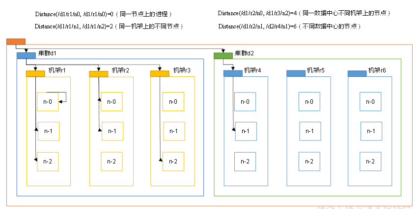

# Hadoop之HDFS
## 第 1 章 HDFS概述
### 1.1 HDFS产出背景及定义
* **HDFS产生背景**
```
随着数据量越来越大，在一个操作系统管理的磁盘存不下所有的数据，那么就分配到更多操作系统管理的磁盘中，但是把数据分配  
分配到不同的机器不方便管理和维护，迫切需要一种文件系统来管理多台机器上的文件，这就是分布式文件管理系统。HDFS只是分  
不是文件管理系统的一种
```
* **HDFS定义**
```
HDFS，它是一个文件系统，用于存储文件，通过目录树来定位文件；其次他是分布式的，由很多服务器联合起来实现其功能，集群  
中的服务器以后各自的角色。  
HDFS的使用场景：适合一次写入，多次读取的场景，且不支持文件的修改。适合用来做数据分析，并不适合用来做网盘。
```

### 1.2 HDFS优缺点
* **优点**
```
1. 高容错性
    (1) 数据自动保存多个副本，它通过增加副本的形式，提高容错性。
    (2) 某个副本丢失以后，它可以自动回复。

2. 适合处理大数据
    (1) 数据规模：能够处理数据规模达到GB、TB、甚至PB级别的数据。
    (2) 文件规模：能够处理百万规模以上的文件数量，数量相当之大。
    
3. 可构建在廉价机器上，通过多副本机制，提高可靠性。
```
* **缺点**
```
1. 不适合低延时数据访问，比如毫秒级的存储数据，是做不到的  

2. 无法高效的对大量小文件进行存储
    (1) 存储大量小文件，会占用NameNode大量的内存来存储文件目录和块信息，因为NameNode的内存总是有限的。
    (2) 小文件存储的寻址时间会超过读取时间，它违反了HDFS的设计目标。
    
3. 不支持并发写入、文件随机修改
    (1) 一个文件只能有一个写，不允许多个线程同时写
    (2) 仅支持数据 append（追加），不支持文件的随机修改。
```

### 1.3 HDFS组成架构
* **HDFS架构图**

* **1. NameNode( nn ) : 就是master，它是一个主管、管理者**
```
(1) 管理HDFS的名称空间
(2) 配置副本策略
(3) 管理数据块（Block）映射信息
(4) 处理客户端读写请求
```

* **2. DataNode：就是Slave，NameNode下达命令，DataNode执行实际的操作**
```
(1) 存储实际的数据块
(2) 执行数据块的读/写操作
```

* **3. client：客户端**
```
(1) 文件切分，文件上传HDFS的时候，Client将文件切分成一个一个的BLOCK，然后进行上传；
(2) 与NameNode交互，获取文件的位置信息；
(3) 与DataNode交互，读取或者写入数据；
(4) Client提供一些命令来管理HDFS，比如NameNode格式化；
(5) Client可以通过一些命令来访问HDFS，比如对HDFS进行增删改查操作；

```

* **4. SecondaryNameNode：并非NameNode的热备。当NameNode挂掉的时候，它并不能马上替换NameNode并提供服务。**
```
(1) 辅助NameNode,分担器工作量，比如定期合并Fsimage和Edits，并推送给NameNode;
(2) 在紧急情况下，可以辅助恢复NameNode；

```

### 1.4 HDFS文件块大小（面试重点）

* **思考：为什么块的大小不能设置太小，也不能设置太大？**
```
（1）HDFS的块设置太小，会增加寻址时间
（2）如果块设置太大，从磁盘传输数据的时间会明显大于寻址时间。导致程序处理这块数据过慢。
总结：HDFS的块大小设置主要取决于磁盘传输速率。
```

## 第 2 章 HDFS的Shell操作（开发重点）
* **1. 基本语法**
```
bin/hadoop    fs    具体命令                OR                bin/hdfs    dfs    具体命令
dfs 是 fs 的实现类
```

* **2. 命令大全**  
**[atguigu@hadoop102 hadoop-2.7.2]$ bin/hadoop fs**
```
    [-appendToFile <localsrc> ... <dst>]
    [-cat [-ignoreCrc] <src> ...]
    [-checksum <src> ...]
    [-chgrp [-R] GROUP PATH...]
    [-chmod [-R] <MODE[,MODE]... | OCTALMODE> PATH...]
    [-chown [-R] [OWNER][:[GROUP]] PATH...]
    [-copyFromLocal [-f] [-p] <localsrc> ... <dst>]
    [-copyToLocal [-p] [-ignoreCrc] [-crc] <src> ... <localdst>]
    [-count [-q] <path> ...]
    [-cp [-f] [-p] <src> ... <dst>]
    [-createSnapshot <snapshotDir> [<snapshotName>]]
    [-deleteSnapshot <snapshotDir> <snapshotName>]
    [-df [-h] [<path> ...]]
    [-du [-s] [-h] <path> ...]
    [-expunge]
    [-get [-p] [-ignoreCrc] [-crc] <src> ... <localdst>]
    [-getfacl [-R] <path>]
    [-getmerge [-nl] <src> <localdst>]
    [-help [cmd ...]]
    [-ls [-d] [-h] [-R] [<path> ...]]
    [-mkdir [-p] <path> ...]
    [-moveFromLocal <localsrc> ... <dst>]
    [-moveToLocal <src> <localdst>]
    [-mv <src> ... <dst>]
    [-put [-f] [-p] <localsrc> ... <dst>]
    [-renameSnapshot <snapshotDir> <oldName> <newName>]
    [-rm [-f] [-r|-R] [-skipTrash] <src> ...]
    [-rmdir [--ignore-fail-on-non-empty] <dir> ...]
    [-setfacl [-R] [{-b|-k} {-m|-x <acl_spec>} <path>]|[--set <acl_spec> <path>]]
    [-setrep [-R] [-w] <rep> <path> ...]
    [-stat [format] <path> ...]
    [-tail [-f] <file>]
    [-test -[defsz] <path>]
    [-text [-ignoreCrc] <src> ...]
    [-touchz <path> ...]
    [-usage [cmd ...]]
```

* **3. 常用命令操作**
**（0）启动Hadoop集群**
```
$ sbin/start-dfs.sh
$ sbin/start-yarn.sh
```
**（1）-help：输入这个命令参数**  
```
$ hadoop fs -help rm
```
**（2）-ls：显示目录信息**  
```
$ hadoop fs -ls /
```
**（3）-mkdir：在HDFS上创建目录**  
```
$ hadoop fs -mkdir -p /sanguo/shuguo
```
**（4）-moveFromLocal：从本地剪切粘贴到HDFS**  
```
$ touch kongming.txt
$ hadoop fs -moveFromLocal ./kongming.txt /sanguo/shuguo
```
**（5）-appendToFile：追加一个文件到已经存在的文件末尾**  
```
$ hadoop fs -appendToFile liubei.txt /sanguo/shuguo/kongming.txt
```
**（6）-cat：显示文件内容**  
```
$ hadoop fs -cat /sanguo/shuguo/kongming.txt
```
**（7）-chgrp、-chmod、-chowm：和Linux命令用法一样**  
```
$ hadoop fs -chmod 666 /sanguo/shuguo/kongming.txt
$ hadoop fs -chown atguigu:atguigu /sanguo/shuguo/kongming.txt
```
**（8）-copyFromLocal：从本地文件系统中拷贝文件到HDFS路径上**  
```
$ hadoop fs -copyFromLocal  README.txt /
```
**（9）-copyToLocal：从HDFS上拷贝到本地**  
```
$ hadoop fs -copyToLocal /sanguo/shuguo/kongming.txt ./
```
**（10）-cp ：从HDFS的一个路径拷贝到HDFS的另一个路径**  
```
$ hadoop fs -cp /sanguo/shuguo/kongming.txt /zhuge.txt
```
**（11）-mv：在HDFS目录中移动文件**  
```
$ hadoop fs -mv /zhuge.txt /sanguo/shuguo/
```
**（12）-get： 等同于copyToLocal,就是从HDFS下载文件到本地**  
```
$ hadoop fs -get /sanguo/shuguo/kongming.txt ./
```
**（13）-getmerge：合并下载多个文件，比如HDFS的目录 /user/atguigu/test下有多个文件:log.1, log.2,log.3,...**  
```
$ hadoop fs -getmerge /user/atguigu/test/* ./zaiyiqi.txt
```
**（14）-put：等同于copyFromLocal**  
```
$ hadoop fs -put ./zaiyiqi.txt /user/atguigu/test
```
**（15）-tail：显示一个文件的末尾**  
```
$ hadoop fs -tail /sanguo/shuguo/kongking.txt
```
**（16）-rm：删除文件或文件夹**  
```
$ hadoop fs -rm /user/atguigu/test/kongming.txt
```
**（17）-rmdir：删除空目录**  
```
$ hadoop fs -rmdir /test
```
**（18）-du：统计文件夹的大小信息**  
```
$ hadoop fs -du -s -h /user/atguigu/test
2.7 K  /user/atguigu/test

$ hadoop fs -du  -h /user/atguigu/test
1.3 K  /user/atguigu/test/README.txt
15     /user/atguigu/test/jinlian.txt
1.4 K  /user/atguigu/test/zaiyiqi.txt
```

**（19）-setrep：设置HDFS中文件的副本数量**  
```
$ hadoop fs -setrep 10 /sanguo/shuguo/kongming.txt  
```

```
这里设置的副本数只是记录在NameNode的元数据中，是否真的会有这么多副本，还得看DataNode的数量。因为目前只有3台设备，  
最多也就3个副本，只有节点数的增加到10台时，副本数才能达到10。
```

## 第 4 章 HDFS的数据流（面试重点）
### 4.1 HDFS写数据流程
#### 4.1.1 剖析文件写入
* **HDFS写数据流程**  
```

1. 客户端通过Distributed FileSystem模块向NameNode请求上传文件，NameNode检查目标问价是否存在，父目录是否存在。
2. NameNode返回是否可以上传。  
3. 客户端请求第一个Block上传到哪几个DataNode服务器上。
4. NameNode返回3个DataNode节点，分别为dn1、dn2、dn3。
5. 客户端通过FSDataOutputStream模块请求dn1上传数据，dn1收到请求会继续调用dn2，然后dn2调用dn3，将这个通信管道建立完成。
6. dn1、dn2、dn3逐级应答客户端。
7. 客户端开始往dn1上传第一个Block（先从磁盘读取数据放到本地内存缓存）,以Packet为单位，dn1收到一个Packet就会传给dn2，dn2  
    传给dn3；dn1每传一个packet会放入一个应答队列等待应答。        
8. 当一个Block传输完成之后，客户端再次请求NameNode上传第二个Block。
```

#### 4.1.2 网络拓扑-节点距离计算
```
在HDFS写数据的过程中，NameNode会选择距离待上传数据距离最近的DataNode接受数据。那么这个最近距离怎么计算呢？
节点距离：两个节点到达最近共同祖先的距离总和。
```


#### 4.1.3 机架感知（副本存储节点选择）
* **Hadoop2.7.2副本节点选择**


### 4.2 HDFS读数据流程
```

1. 客户端通过Distributed FileSystem 向 NameNode 请求下载文件，NameNode通过查询元数据，找到文件块所在的DataNode地址。
2. 挑选一台DataNode（就近原则，然后随机）服务器，请求读取数据。
3. DataNode开始传输数据给客户端（从磁盘里面读取数据输入流，以Packet为单位来做校验）。
4. 客户端已Packet为单位接受，先本地缓存，然后写入目标文件。
```

## 第 5 章 NameNode 和 SecondaryNameNode(面试开发重点)
### 5.1 NN 和 2NN 工作机制
**思考：NameNode中的源数据存储在哪里？**
```
首先，我们做个假设，如果存储在NameNode节点的磁盘中，因为经常需要进行随机访问，还要响应客户端请求，必然是效率过低。因此,元数据  
需要存放在内存中。但如果只存在内存中，一旦断电，元数据就会丢失，整个集群就无法工作了。**因此产生在磁盘中备份元数据的FsImage**。

这样又会带来新问题，当在内存中的元数据更新时，如果同时更新FsImage，就会导致效率过低，但如果不更新，就会发生一致性问题，一旦NameNode  
节点断电，就会产生数据丢失。因此，引入Edits文件（只进行追加操作，效率很高）。每当元数据有更新或者添加元数据时，修改内存中的元数据并追加  
到Edits中。这样，一旦NameNode节点断电，可以通过FsImage和Edits的合并，合成元数据。

但是，如果长时间添加数据到Edits中，会导致该文件数据量过大，效率降低，而且一旦断电，恢复元数据需要的时间过长。因此，需要定期进行FsImage和  
Edits的合并，如果这个操作有NameNode节点完成，又会效率过低。因此，引入一个新的节点SecondaryNameNode,专门用于FsImage和Edits的合并。
```

* **NN 和 2NN工作机制**  

* **1. 第一阶段：NameNode启动**
```
(1) 第一次启动NameNode格式化后，创建FsImage和Edits文件。如果不是第一次启动，直接加载编辑日志和镜像文件到内存。
(2)客户端对元数据进行增删改请求。
(3)NameNode记录操作日志，更新滚动日志。
(4)NameNode在内存中对数据进行增删改。
```

* **2. 第二阶段：SecondaryNameNode 工作**
```
(1) SecondaryNameNode询问NameNode是否需要CheckPoint。直接带回NameNode是否检查结果。
(2) SecondaryNameNode请求执行CheckPoint。
(3) NameNode滚动正在写的Edits日志。
(4) 将滚动前的编辑日志和镜像文件拷贝到SecondaryNameNode。
(5) SecondaryNameNode 加载编辑日志和镜像文件到内存，并合并。
(6) 生成新的镜像文件fsimage.chkpoint。
(7) 拷贝FsImage。chkpoint 到 NameNode。
(8) NameNode 将 FsImage.chkpoint 重新命名成FsImage
```

* **NN 和 2NN 工作机制详解：**
```
FsImage：NameNode内存中元数据序列化后形成的文件。
Edits：记录客户端更新元数据信息的每一步操作（可以通过Edits运算出元数据）。

NameNode启动时，先滚动Edits并生成一个空的edits.inprogress，然后加载Edits和FsImage到内存中，此时NameNode内存就  
持有最新的元数据信息。Client开始对NameNode发送元数据的增删改的请求，这些请求的操作首先会被记录到edits.inprogress  
中（查询元数据的操作不会被记录在Edits中，应为查询操作不会更改元数据信息），如果此时NameNode挂掉，重启后会从Edits  
中读取元数据的信息。然后，NameNode会在内存中执行元数据的增删改的操作。、

由于Edits中记录的操作会越来越多，Edits文件会越来越大，导致NameNode在启动加载Edits是会很慢，所以需要对Edits和FsImage  
进行合并（所谓合并，就是讲Edits和FsImage加载到内存中，照着Edits中的操作一步一步执行，最终形成新的FsImage）。

SecondaryNameNode的作用 是帮助NameNode进行Edits和FsImage的合并工作。SecondaryNameNode首先会询问NameNode  
是否需要CheckPoint（出发CheckPoint需要两个条件中的任意一个，定时时间到 和 Edits中数据写满了）。直接带回NameNode是  
否检查结果。SecondaryNameNode执行CheckPoint操作，首先会让NameNode滚动Edits并生成一个空的edits.inprogress，滚动  
Edits的目的是给Edits打个标记，以后所有新的操作都写入edits.inprogress,其他未合并的Edits和FsImage会拷贝到SecondaryNameNode  
的本地，然后将拷贝的Edits 和 FsImage加载到内存中进行和并， 生成FsImage.chkpoint,然后将FsImage.chkpoint拷贝给NameNode，  
重命名为FsImage后替换掉原来的FsImage。NameNode在启动时就只需要加载之前为合并的Edits和FsImage即可，因为合并过的Edits  
中的元数据信息已经被记录在FsImage中。
```

### 5.2 FsImage 和 Edits 解析
* **1. FsImage和Edits概念**
```
NameNode被格式化之后，将在/opt/module/hadoop-2.7.2/data/tmp/dfs/name/current目录中产生如下文件：
fsimage_00000000000000000000000000
fsimage_00000000000000000000000000.md5
seen_txid
VERSION

(1) Fsimage文件：HDFS文件系统元数据的一个永久性的检查点，其中包含HDFS文件系统的所有目录和文件inode的序列化信息。
(2) Edits文件：存放HDFS文件系统的所有更新操作的路径，文件系统客户端执行的所有写操作首先会被记录到Edits文件中。
(3) seen_txid文件：保存的是一个数字，就是最后一个edits_ 的数字。
(4) 每次NameNode启动的时候都会将FsImage文件读入内存中，加载Edits里面的更新操作，保证内存中的元数据信息是罪行的、  
同步的，可以看成NameNode启动的时候就将FsImage和Edits文件进行了合并。
```

* **2. oiv查看FsImage文件**
```
思考：可以看出，Fsimage中没有记录块所对应DataNode，为什么？
思考：NameNode如何确定下次开机启动的时候合并哪些Edits？
```

### 5.3 CheckPoint 时间设置
* **1. 通常情况下，SecondaryNameNode每隔一小时执行一次**
```
[hdfs-default.xml]
<property>
  <name>dfs.namenode.checkpoint.period</name>
  <value>3600</value>
</property>
```

* **2. 一分钟检查一次操作次数**
```
<property>
  <name>dfs.namenode.checkpoint.check.period</name>
  <value>60</value>
  <description> 1分钟检查一次操作次数</description>
</property >
```

* **3. 当操作次数达到1百万时，SecondaryNameNode执行一次**
```
<property>
  <name>dfs.namenode.checkpoint.txns</name>
  <value>1000000</value>
  <description>操作动作次数</description>
</property>
```

### 5.4 NameNode故障处理
NameNode故障后，可以采用如下两种方式恢复数据。
* **方法一：将SecondaryNameNode中数据拷贝到NameNode存储数据的目录**
```
1. kill -9 NameNode进程
2. 删除NameNode存储的数据（/opt/module/hadoop-2.7.2/data/tmp/dfs/name）
    $ rm -rf /opt/module/hadoop-2.7.2/data/tmp/dfs/name/*
3. 拷贝SecondaryNameNode中数据到源NameNode存储数据目录
    $ scp -r atguigu@hadoop104:/opt/module/hadoop-2.7.2/data/tmp/dfs/namesecondary/* ./name/
4. 重启NameNode
    $ sbin/hadoop-daemon.sh start namenode
```

* **方法二：使用 -importCheckpoint选项启动NameNode守护进程，从而将SecondaryNameNode中数据拷贝到NameNode目录中**
```
1. 修改hdfs-site.xml中的  
    <property>
      <name>dfs.namenode.checkpoint.period</name>
      <value>120</value>
    </property>
    <property>
      <name>dfs.namenode.name.dir</name>
      <value>/opt/module/hadoop-2.7.2/data/tmp/dfs/name</value>
    </property>
2. kill -9 NameNode进程
3. 删除NameNode存储的数据（/opt/module/hadoop-2.7.2/data/tmp/dfs/name）  
    $ rm -rf /opt/module/hadoop-2.7.2/data/tmp/dfs/name/*
4. 如果SecondaryNameNode不和NameNode在一个主机节点上，需要将SecondaryNameNode存储数据的目录拷贝到NameNode  
    存储数据的评级目录，并删除in_use.lock文件  
    $ scp -r atguigu@hadoop104:/opt/module/hadoop-2.7.2/data/tmp/dfs/namesecondary   ./  
    $ rm -rf in_use.lock
5. 导入检查点数据（等待一会Ctrl + c 结束掉）
    $ bin/hdfs namenode -importCheckpoint  
6. 启动NameNode  
    $ sbin/hadoop-daemon.sh start namenode
```

### 5.5 集群安全模式  
* **1. 概述**  
**(1) NameNode启动**
```
    NameNode 启动时，首先将镜像文件（FsImage）载入内存，并执行编辑日志（Edits）中的各项操作。一旦在内存中成功  
    建立文件系统元数据的镜像，则创建一个新的FsImage文件和一个空的编辑日志。此时，NameNode开始监听DataNode请  
    求。这个过程期间，NameNode一直运行在安全模式，即NameNode的文件系统对于客户端来说是只读的。
```
**(2) DataNode启动**  
```
    系统中的数据块的位置并不是由Namenode维护的，而是以块列表的形式存储在DataNode中。在系统的正常操作期间，NameNode
    会在内存中保留所有块位置的映射信息。在安全模式下，各个DataNode会向NameNode发送最新的快列表信息，NameNode了解到
    足够多的块位置信息之后，即可高效运行文件系统。
```
**(3) 安全模式退出判断**
```
    如果满足“最小副本条件”，NameNode会在30s之后就退出安全模式。所谓的最小副本条件指的是在整个文件系统中99.9%的块满足  
    最小副本级别（默认值：dfs.replication.mim=1）。在启动一个刚刚格式化的HDFS集群时，因为系统中还没有任何块，所以NameNode  
    不会进入安全模式。
```

* **2. 基本语法**
```
集群处于安全模式，不能执行重要操作（写操作）。集群启动完成后，自动退出安全模式。
（1）bin/hdfs dfsadmin -safemode get		（功能描述：查看安全模式状态）
（2）bin/hdfs dfsadmin -safemode enter  	（功能描述：进入安全模式状态）
（3）bin/hdfs dfsadmin -safemode leave	（功能描述：离开安全模式状态）
（4）bin/hdfs dfsadmin -safemode wait	（功能描述：等待安全模式状态）
```

### 5.6 NameNode多目录配置
* 1. NameNode的本地目录可以配置成多个，且每个目录存放内容相同，增加了可靠性  
* 2. 具体配置如下
**(1) 在hdfs-site.xml文件中增加如下内容**
```
<property>
    <name>dfs.namenode.name.dir</name>
    <value>file:///${hadoop.tmp.dir}/dfs/name1,file:///${hadoop.tmp.dir}/dfs/name2</value>
</property>
```
**(2) 停止集群，删除data和logs中所有数据**
```
[atguigu@hadoop102 hadoop-2.7.2]$ rm -rf data/ logs/
[atguigu@hadoop103 hadoop-2.7.2]$ rm -rf data/ logs/
[atguigu@hadoop104 hadoop-2.7.2]$ rm -rf data/ logs/
```
**(3) 格式化集群并启动**
```
[atguigu@hadoop102 hadoop-2.7.2]$ bin/hdfs namenode –format
[atguigu@hadoop102 hadoop-2.7.2]$ sbin/start-dfs.sh
```
**(4) 查看结果**
```
[atguigu@hadoop102 dfs]$ ll
总用量 12
drwx------. 3 atguigu atguigu 4096 12月 11 08:03 data
drwxrwxr-x. 3 atguigu atguigu 4096 12月 11 08:03 name1
drwxrwxr-x. 3 atguigu atguigu 4096 12月 11 08:03 name2
```

## 第 6 章 DataNode（面试开发重点）
### 6.1 DataNode工作机制

```
1. 一个数据块在DataNode上以文件形式存储在磁盘上，包括两个文件，一个是数据本身，一个是元数据包括数据块的长度，  
块数据的校验和，以及时间戳。
2. DataNode启动后向NameNode注册，通过后，周期性（1小时）的向NameNode上报所有的块信息。
3. 心跳是每3秒一次，心跳返回结果带有NameNode给改DataNode的命令，如复制块数据到另一台机器，或删除某个数据块  
如果超过10分钟没有收到某个DataNode的心跳，则认为该节点不可用。
4. 集群运行中可以安全加入和退出一些机器。
```

### 6.2 数据完整性

```
1. 当DataNode读取Block的时候，他会计算CheckSum。
2. 如果计算后的CheckSum，与Block创建时的值不一样，说明Block已经损坏。
3. Client读取其他DataNode上的Block
4. DataNode在其文件创建后周期验证CheckSum
```

### 6.3 掉线时限参数设置

```
需要注意的是hdfs-site.xml配置文件中的 heartbeat.recheck.interval的单位为毫秒，dfs.heartbeat.interval的单位为秒。
<property>
    <name>dfs.namenode.heartbeat.recheck-interval</name>
    <value>300000</value>
</property>
<property>
    <name>dfs.heartbeat.interval</name>
    <value>3</value>
</property>
```

### 6.4 服役新数据节点
* **0. 需求**  
```
随着公司业务的增长，数据量越来越大，原有的数据节点的容量已经不能满足存储数据的需求，需要在原有集群基础上动态添加新的数据节点。
```
* **1. 环境准备**
```
(1) 在hadoop104主机上再克隆一台Hadoop105主机
(2) 修改IP地址和主机名称  
(3) 删除原来HDFS文件系统留存的文件(/opt/module/hadoop-2.7.2/data和log)  
(4) 更新配置文件：$ source /etc/profile
```
* **2. 服务新节点具体步骤**
```
(1) 直接启动DataNode,即可关联到集群
    [atguigu@hadoop105 hadoop-2.7.2]$ sbin/hadoop-daemon.sh    start    datanode
    [atguigu@hadoop105 hadoop-2.7.2]$ sbin/yarn-daemon.sh    start    nodemanager
(2) 在hadoop105上上传文件
    $ hadoop    fs    -put    /opt/module/hadoop-2.7.2/LICENSE.txt    /
(3) 如果数据不均衡，可以用命令实现集群的再平衡
    $ ./start-balancer.sh
```

### 6.5 退役旧数据节点
#### 6.5.1 添加白名单
添加到白名单的主机节点，都允许访问NameNode，不在白名单的主机节点，都会别退出。
**配置白名单的具体步骤如下：**
* **1. 在NameNode的/opt/module/hadoop-2.7.2/etc/hadoop目录下创建dfs.hosts文件**
```
    [atguigu@hadoop102 hadoop]$ touch dfs.hosts
    [atguigu@hadoop102 hadoop]$ vi dfs.hosts
    添加如下主机名称（不添加hadoop105）
    hadoop102
    hadoop103
    hadoop104
```
* **2. 在NameNode的hdfs-site.xml配置文件中增加dfs.hosts属性**
```
    <property>
        <name>dfs.hosts</name>
        <value>/opt/module/hadoop-2.7.2/etc/hadoop/dfs.hosts</value>
    </property>
```
* **3. 配置文件分发**
```
    $ xsync hdfs-site.xml
```
* **4. 刷新NameNode**
```
    $ hdfs    dfsadmin    -refreshNodes
```
* **5. 更新ResourceManager节点**
```
    $ yarn    rmadmin    -refreshNodes
```
* **6. 在web浏览器上查看,没有hadoop105节点**

* **7. 如果数据不均衡，可以用命令实现集群的再平衡**
```
    $ ./start-balancer.sh
```

#### 6.5.2 黑名单退役
**在黑名单上面的主机都会被强制退出。**
* **1. 在NameNode的/opt/module/hadoop-2.7.2/etc/hadoop目录下创建dfs.hosts.exclude文件**
```
    [atguigu@hadoop102 hadoop]$ touch dfs.hosts.exclude
    [atguigu@hadoop102 hadoop]$ vi dfs.hosts.exclude
    添加如下主机名称（要退役的节点）
    hadoop105
```
* **2. 在NameNode的hdfs-site.xml配置文件中增加dfs.hosts.exclude属性**
```
    <property>
          <name>dfs.hosts.exclude</name>
          <value>/opt/module/hadoop-2.7.2/etc/hadoop/dfs.hosts.exclude</value>
    </property>
```
* **3. 刷新NameNode、刷新ResourceManager**
```
    [atguigu@hadoop102 hadoop-2.7.2]$ hdfs dfsadmin -refreshNodes
    [atguigu@hadoop102 hadoop-2.7.2]$ yarn rmadmin -refreshNodes
```
* **4. 检查Web浏览器，退役节点的状态为decommission in progress（退役中），说明数据节点正在复制块到其他节点，如图**

* **5. 等待退役节点状态为decommissioned（所有块已经复制完成），停止该节点及节点资源管理器。注意：如果副本数是3，  
服役的节点小于等于3，是不能退役成功的，需要修改副本数后才能退役，如图**

```
    $ sbin/hadoop-daemon.sh    stop    datanode
    $ sbin/yarn-daemon.sh    stop    nodemanager
```
* **6.	如果数据不均衡，可以用命令实现集群的再平衡**
```
    $ sbin/start-balancer.sh
```

**注意：不允许白名单和黑名单中同时出现同一个主机名称。**

### 6.6 Datanode多目录配置
* **1.	DataNode也可以配置成多个目录，每个目录存储的数据不一样。即：数据不是副本**
* **2．具体配置如下 hdfs-site.xml**
```
<property>
        <name>dfs.datanode.data.dir</name>
        <value>file:///${hadoop.tmp.dir}/dfs/data1,file:///${hadoop.tmp.dir}/dfs/data2</value>
</property>
```


## 第7章 HDFS 2.X新特性
### 7.1 集群间数据拷贝
* **1.scp实现两个远程主机之间的文件复制**
```
    scp     -r     hello.txt     root@hadoop103:/user/atguigu/hello.txt		// 推 push
	scp     -r     root@hadoop103:/user/atguigu/hello.txt      hello.txt		// 拉 pull
	//是通过本地主机中转实现两个远程主机的文件复制；如果在两个远程主机之间ssh没有配置的情况下可以使用该方式。
	scp     -r     root@hadoop103:/user/atguigu/hello.txt     root@hadoop104:/user/atguigu     
```

* **2. 采用distcp命令实现两个Hadoop集群之间的递归数据复制**
[atguigu@hadoop102 hadoop-2.7.2]$  bin/hadoop distcp
hdfs://haoop102:9000/user/atguigu/hello.txt     hdfs://hadoop103:9000/user/atguigu/hello.txt

### 7.2 小文件存档
* **1. HDFS存储小文件弊端**
```
每个文件均按块存储，每个块的元数据存储在NameNode的内存中，因此HDFS存储小文件会非常抵消。因为大量的小文件
会耗尽NameNode中的大部分内存。但注意，存储小文件所需要的磁盘容量和数据块的大小无关。
```

* **2. 解决存储小文件办法之一**
```
HDFS存档文件或HAR文件，是一个更高效的文件存储工具，他将文件存入HDFS块，在减少NameNode内存使用的同时，允许  
对文件进行透明的访问。具体说来，HDFS存档文件对内还是一个一个独立文件，对NameNode而言却是一个整体，减少了  
NameNode的内存。
```


* **3. 案例实操**  
```
(1) 需要启动YARN进程
    $ start-yarn.sh
(2) 归档文件
    把/user/atguigu/input 目录里面的所有文件归档成一个叫input.har的归档文件，并把归档后文件存储到/user/atguigu/output路径下
    $ bin/hadoop    archive    -archiveName    input.har    -p    /user/atguigu/input   /user/atguigu/output
 (3) 查看归档
    $ hadoop    fs    -lsr    /user/atguigu/output/input.har
    $ hadoop    fs    -lsr    har:///user/atguigu/output/input.har
(4) 解归档文件
    $ hadoop    fs    -cp    har:/// user/atguigu/output/input.har/*    /user/atguigu
```

### 7.3 回收站
**开启回收站功能，可以将删除的文件在不超时的情况下，恢复原数据，起到防止误删除、备份等作用。**  
* **1．回收站参数设置及工作机制**  

* **2．启用回收站**
```
修改core-site.xml，配置垃圾回收时间为1分钟。
<property>
    <name>fs.trash.interval</name>
    <value>1</value>
</property>
```
* **3．查看回收站**
```
回收站在集群中的路径：/user/atguigu/.Trash/….
```
* **4．修改访问垃圾回收站用户名称**
```
进入垃圾回收站用户名称，默认是dr.who，修改为atguigu用户
[core-site.xml]
<property>
    <name>hadoop.http.staticuser.user</name>
    <value>atguigu</value>
</property>
```
* **5.	通过程序删除的文件不会经过回收站，需要调用moveToTrash()才进入回收站**
```
Trash trash = New Trash(conf);
trash.moveToTrash(path);
```
* **6.	恢复回收站数据**
```
[atguigu@hadoop102 hadoop-2.7.2]$ hadoop fs -mv
/user/atguigu/.Trash/Current/user/atguigu/input    /user/atguigu/input
```
* **7.	清空回收站**
```
[atguigu@hadoop102 hadoop-2.7.2]$ hadoop fs -expunge
```

### 7.4 快照管理
* **1. 快照管理**  

* **2．案例实操**  
**（1）开启/禁用指定目录的快照功能**
```
[atguigu@hadoop102 hadoop-2.7.2]$ hdfs dfsadmin -allowSnapshot /user/atguigu/input
[atguigu@hadoop102 hadoop-2.7.2]$ hdfs dfsadmin -disallowSnapshot /user/atguigu/input
```
**（2）对目录创建快照**
```
[atguigu@hadoop102 hadoop-2.7.2]$ hdfs dfs -createSnapshot /user/atguigu/input
通过web访问hdfs://hadoop102:50070/user/atguigu/input/.snapshot/s…..// 快照和源文件使用相同数据
[atguigu@hadoop102 hadoop-2.7.2]$ hdfs dfs -lsr /user/atguigu/input/.snapshot/
```
**（3）指定名称创建快照**
```
[atguigu@hadoop102 hadoop-2.7.2]$ hdfs dfs -createSnapshot /user/atguigu/input  miao170508
```
**（4）重命名快照**
```
[atguigu@hadoop102 hadoop-2.7.2]$ hdfs dfs -renameSnapshot /user/atguigu/input/  miao170508 atguigu170508
```
**（5）列出当前用户所有可快照目录**
```
[atguigu@hadoop102 hadoop-2.7.2]$ hdfs lsSnapshottableDir
```
**（6）比较两个快照目录的不同之处**
```
[atguigu@hadoop102 hadoop-2.7.2]$ hdfs snapshotDiff
/user/atguigu/input/  .  .snapshot/atguigu170508	
```
**（7）恢复快照**
```
[atguigu@hadoop102 hadoop-2.7.2]$ hdfs dfs -cp
/user/atguigu/input/.snapshot/s20170708-134303.027 /user
```


