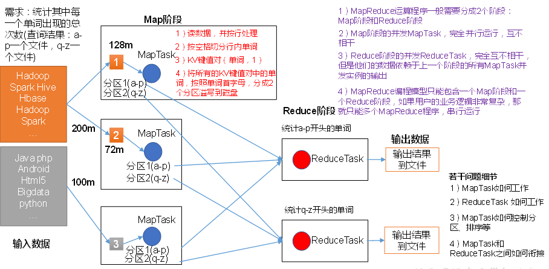
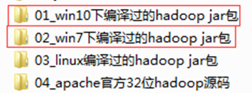
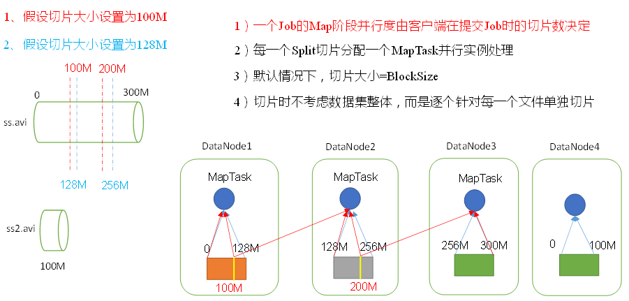

# Hadoop之MapReduce
## 第 1 章 MapReduce概述
### 1.1 MapReduce定义
```
MapReduce是一个分布式运算程序的编程框架，是用户开发“基于Hadoop的数据分析应用”的核心框架。
MapReduce核心功能是将用户编写的业务逻辑代码和自带默认组件整合成一个完整的分布式运算程序，并发运行在一个Hadoop集群上。
```
### 1.2 MapReduce优缺点
#### 1.2.1 优点
* **1. MapReduce易于编程**
```
他简单的实现一些接口，就可以完成一个分布式程序，这个分布式程序可以分布发哦大量廉价的PC机器上运行。也就是说你写一个  
分布式程序，跟写一个简单的串行程序时一模一样的。就是因为这个特点使得MapReduce编程变得非常流行。
```
* **2. 良好的扩展性**  
```
当你的计算资源不能满足的时候，你可以通过简单的增加机器来扩展他的计算能力。
```
* **3. 高容错性**  
```
MapReduce设计的初衷就是使程序能够部署在廉价的PC机器上，这就要求他具有很高的容错性。比如其中一台机器挂了，他可以  
把上面的计算任务转移到另外一个节点上运行，不至于这个任务运行失败，而且这个过程不需要人工参与，而是完全有Hadoop内  
部完成的。
```
* **4. 适合PB级以上海量数据的离线处理**  
```
可以实现上千台服务器集群并发工作，提供数据处理能力。
```

#### 1.2.2 缺点
* **1. 不擅长实时计算**  
```
MapReduce无法像MySQL一样，在毫秒或者秒级内返回结果。
```
* **2. 不擅长流式计算**
```
流式计算的输入数据是动态的，而MapReduce的输入数据集是静态的，不能动态变化。这是因为MapReduce自身的设计特点决定了  
数据源必须是静态的。
```
* **3. 不擅长DAG（有向图）计算**  
```
过个应用程序存在依赖关系，后一个应用程序的输入为前一个的输出。在这种情况下，MapReduce并不是不能做，而是使用后，每个  
MapReduce作业的输出结果都会写入到磁盘，会造成大量的磁盘IO，导致性能非常的底下。
```


### 1.3 MapReduce核心思想

```
1. 分布式的运算程序往往需要分成至少2个阶段。
2. 第一个阶段的MapTask并发实例，完全并行运行，互不相干。
3. 第二个阶段的ReduceTask并发实例互不相干，但是他们的数据依赖于上一个阶段的所有MapTask并发实例的输出
4. MapReduce编程模型只能包含一个Map阶段和一个Reduce，如果用户的业务逻辑非常复杂，那就只能多个MapReduce程序串行运行。
总结：分析WordCOunt数据流走向深入理解MapReduce核心思想。
```

### 1.4 MapReduce进程
**一个完整的MapReduce程序在分布式运行时有三个实例进程：**
```
1. MrAppMaster：负责整个程序的过程调度及状态协调。
2. MapTask：负责Map阶段的整个数据处理流程。
3. ReduceTask：负责Reduce阶段的整个数据处理流程。
```

### 1.6 常用数据序列化类型
|    java类型    |    Hadoop Writable 类型    |
|    ---    |    ---    |
|   boolean    |    BooleanWritable    |
|    byte    |  ByteWritable      |
|    int    |    IntWritable    |
|    float    |    FloatWritable    |
|    long    |    LongWritable    |
|    double    |    DoubleWritable    |
|    String    |    Text    |
|    map    |    MapWritable    |
|    array    |    ArrayWritable    |


### 1.7 MapReduce编程规范
**用户编写的程序分为三个部分：Mapper、Reducer  和  Driver。**
* **1. Mapper阶段**
```
(1) 用户定义的Mapper要继承自己的父类
(2) Mapper的输入数据时KV对的形式（KV的类型可自定义）
(3) Mapper中的业务逻辑写在map()方法中
(4) Mapper的输出数据是KV对的形式（KV的类型可自定义）
(5) map()方法（MapTask进程）对每一个<K, V>调用一次
```

* **2. Reduce阶段**
```
(1) 用户定义的Reduce要继承自己的父类
(2) Reducer的输入数据类型对应Mapper的输出数据类型，也是KV
(3) Reducer的业务逻辑写在reduce()方法中
(4) ReducerTask进程对每一组相同k的<k, v>组调用一次reduce()方法
```
* **3. Driver阶段**
```
相当于YARN集群的客户端，用于提交我们整个程序到YARN集群，提交的是封装了MapReduce程序相关运行参数的job对象。
```

### 1.8 WordCount案例实操
* **1. 在pom.xml文件中添加如下依赖**
```
<dependencies>
		<dependency>
			<groupId>junit</groupId>
			<artifactId>junit</artifactId>
			<version>RELEASE</version>
		</dependency>
		<dependency>
			<groupId>org.apache.logging.log4j</groupId>
			<artifactId>log4j-core</artifactId>
			<version>2.8.2</version>
		</dependency>
		<dependency>
			<groupId>org.apache.hadoop</groupId>
			<artifactId>hadoop-common</artifactId>
			<version>2.7.2</version>
		</dependency>
		<dependency>
			<groupId>org.apache.hadoop</groupId>
			<artifactId>hadoop-client</artifactId>
			<version>2.7.2</version>
		</dependency>
		<dependency>
			<groupId>org.apache.hadoop</groupId>
			<artifactId>hadoop-hdfs</artifactId>
			<version>2.7.2</version>
		</dependency>
</dependencies>
```
* **2. 在项目的src/main/resources目录下，新建一个文件，命名为“log4j.properties”，在文件中填入**
```
log4j.rootLogger=INFO, stdout
log4j.appender.stdout=org.apache.log4j.ConsoleAppender
log4j.appender.stdout.layout=org.apache.log4j.PatternLayout
log4j.appender.stdout.layout.ConversionPattern=%d %p [%c] - %m%n
log4j.appender.logfile=org.apache.log4j.FileAppender
log4j.appender.logfile.File=target/spring.log
log4j.appender.logfile.layout=org.apache.log4j.PatternLayout
log4j.appender.logfile.layout.ConversionPattern=%d %p [%c] - %m%n
```

* **3. 编写Mapper类**
```
package com.atguigu.mapreduce;
import java.io.IOException;
import org.apache.hadoop.io.IntWritable;
import org.apache.hadoop.io.LongWritable;
import org.apache.hadoop.io.Text;
import org.apache.hadoop.mapreduce.Mapper;

public class WordcountMapper extends Mapper<LongWritable, Text, Text, IntWritable>{
	
	Text k = new Text();
	IntWritable v = new IntWritable(1);
	
	@Override
	protected void map(LongWritable key, Text value, Context context)	throws IOException, InterruptedException {
		
		// 1 获取一行
		String line = value.toString();
		
		// 2 切割
		String[] words = line.split(" ");
		
		// 3 输出
		for (String word : words) {
			
			k.set(word);
			context.write(k, v);
		}
	}
}
```

* **4. 编写Reducer类**
```
package com.atguigu.mapreduce.wordcount;
import java.io.IOException;
import org.apache.hadoop.io.IntWritable;
import org.apache.hadoop.io.Text;
import org.apache.hadoop.mapreduce.Reducer;

public class WordcountReducer extends Reducer<Text, IntWritable, Text, IntWritable>{

int sum;
IntWritable v = new IntWritable();

	@Override
	protected void reduce(Text key, Iterable<IntWritable> values,Context context) throws IOException, InterruptedException {
		
		// 1 累加求和
		sum = 0;
		for (IntWritable count : values) {
			sum += count.get();
		}
		
		// 2 输出
       v.set(sum);
		context.write(key,v);
	}
}
```

* **5. 编写Driver驱动类**
```
package com.atguigu.mapreduce.wordcount;
import java.io.IOException;
import org.apache.hadoop.conf.Configuration;
import org.apache.hadoop.fs.Path;
import org.apache.hadoop.io.IntWritable;
import org.apache.hadoop.io.Text;
import org.apache.hadoop.mapreduce.Job;
import org.apache.hadoop.mapreduce.lib.input.FileInputFormat;
import org.apache.hadoop.mapreduce.lib.output.FileOutputFormat;

public class WordcountDriver {

	public static void main(String[] args) throws IOException, ClassNotFoundException, InterruptedException {

		// 1 获取配置信息以及封装任务
		Configuration configuration = new Configuration();
		Job job = Job.getInstance(configuration);

		// 2 设置jar加载路径
		job.setJarByClass(WordcountDriver.class);

		// 3 设置map和reduce类
		job.setMapperClass(WordcountMapper.class);
		job.setReducerClass(WordcountReducer.class);

		// 4 设置map输出
		job.setMapOutputKeyClass(Text.class);
		job.setMapOutputValueClass(IntWritable.class);

		// 5 设置最终输出kv类型
		job.setOutputKeyClass(Text.class);
		job.setOutputValueClass(IntWritable.class);
		
		// 6 设置输入和输出路径
		FileInputFormat.setInputPaths(job, new Path(args[0]));
		FileOutputFormat.setOutputPath(job, new Path(args[1]));

		// 6 设置输入和输出路径
		boolean result = job.waitForCompletion(true);

		System.exit(result ? 0 : 1);
	}
}
```

* **6. 本地测试**
```
（1）如果电脑系统是win7的就将win7的hadoop jar包解压到非中文路径，并在Windows环境上配置HADOOP_HOME环境变量。如果是电脑win10操作系统，就解压win10的hadoop jar包，并配置HADOOP_HOME环境变量。
注意：win8电脑和win10家庭版操作系统可能有问题，需要重新编译源码或者更改操作系统。
（2）在Eclipse/Idea上运行程序
```
 

* **7. 集群上测试**
**（0）用maven打jar包，需要添加的打包插件依赖**
注意：标记红颜色的部分需要替换为自己工程主类
```
<build>
		<plugins>
			<plugin>
				<artifactId>maven-compiler-plugin</artifactId>
				<version>2.3.2</version>
				<configuration>
					<source>1.8</source>
					<target>1.8</target>
				</configuration>
			</plugin>
			<plugin>
				<artifactId>maven-assembly-plugin </artifactId>
				<configuration>
					<descriptorRefs>
						<descriptorRef>jar-with-dependencies</descriptorRef>
					</descriptorRefs>
					<archive>
						<manifest>
							<mainClass>com.atguigu.mr.WordcountDriver</mainClass>
						</manifest>
					</archive>
				</configuration>
				<executions>
					<execution>
						<id>make-assembly</id>
						<phase>package</phase>
						<goals>
							<goal>single</goal>
						</goals>
					</execution>
				</executions>
			</plugin>
		</plugins>
	</build>
```
注意：如果工程上显示红叉。在项目上右键->maven->update project即可。
**（1）将程序打成jar包，然后拷贝到Hadoop集群中**
步骤详情：右键->Run as->maven install。等待编译完成就会在项目的target文件夹中生成jar包。如果看不到。在项目上右键-》Refresh，即可看到。修改不带依赖的jar包名称为wc.jar，并拷贝该jar包到Hadoop集群。
**（2）启动Hadoop集群**
**（3）执行WordCount程序**
```
[atguigu@hadoop102 software]$ hadoop jar  wc.jar
 com.atguigu.wordcount.WordcountDriver /user/atguigu/input /user/atguigu/output
```


## 第 2 章 Hadoop序列化
### 2.1 序列化概述
* **1. 什么是序列化**|    
```
序列化：就是把内存中的对象，转换成字节序列（或其他数据传输协议）以便于存储到磁盘（持久化）和网络传输。
反序列化：就是将收到的字节序列（或其他数据传输协议）或者是磁盘的持久化数据，转换成内存中的对象。
```

* **2. 为什么要序列化**  
```
一般来说，“活的”对象值生存在内存里，关机断电就没有了。而且“活的”对象只能由本地的进程使用，不能被发送到  
网络上的另一台计算机。然后序列化可以存储“活的"对象，可以将"活的"对象发送到远程计算机。
```

* **3. 为什么不用Java的序列化**  
```
Java的序列化是一个重量级序列化框架（Serializable）,一个对象被序列化后，会附带很多额外的信息（各种校验信息，  
Header、集成体系），不便于在网络中高效传输。所以，Hadoop自己开发了一套序列化机制（Writable）。
Hadoop序列化特点：
(1) 紧凑：高效实用存储空间
(2) 快速：读写数据的额外开销小。
(3) 可扩展：随着通信协议的升级而可升级
(4) 互操作：支持多语言的交互
```

### 2.2 自定义bean对象实现序列化接口（Writable）
在企业开发中往往常用的基本序列化类型不能操作所有需求，比如在Hadoop框架内部传递一个bean对象，那么该对象就  
需要实现序列化接口。
**具体实现bean对象序列化步骤如下7步：**
* **1. 必须实现Writable接口**
* **2. 反序列化时，需要反射调用空参构造函数，所以必须有孔灿构造器**
```
public FlowBean() {
	super();
}
```
* **3. 重写序列化方法**
```
@Override
public void write(DataOutput out) throws IOException {
	out.writeLong(upFlow);
	out.writeLong(downFlow);
	out.writeLong(sumFlow);
}
```
* **4. 重写反序列化方法**
```
@Override
public void readFields(DataInput in) throws IOException {
	upFlow = in.readLong();
	downFlow = in.readLong();
	sumFlow = in.readLong();
}
```
* **5. 注意反序列化的顺序和序列化的顺序完全一致**
* **6. 要想把结果显示在文件中，需要重写toString()，可用”\t”分开，方便后续用**
* **7. 如果需要将自定义的bean放在key中传输，则还需要实现Comparable接口，因为MapReduce框架中的Shuffle过程要求  
必须对key排序**
```
@Override
public int compareTo(FlowBean o) {
	// 倒序排列，从大到小
	return this.sumFlow > o.getSumFlow() ? -1 : 1;
}
```

## 第3章 MapReduce框架原理
### 3.1 InputFormat
#### 3.1.1 切片与MapTask并行度决定机制
* **1. 问题引入**  
```
MapTask的并行度决定Map阶段的任务处理并发度，进而影响到整个Job的处理速度。
思考：1G的数据，启动8个MapTask，可以提高集群的并发处理能力。那么1K的数据，也启动8个MapTask，会提高集群性能吗？
MapTask并行任务是否越多越好呢？哪些因素影响了MapTask并行度？
```

* **2. MapTask并行度决定机制**
数据块：Block是HDFS物理上把数据分成一块一块。
数据切片：数据切片只是在逻辑是在逻辑上对输入进行分片，并不会在磁盘上将其切分成片进行存储。



